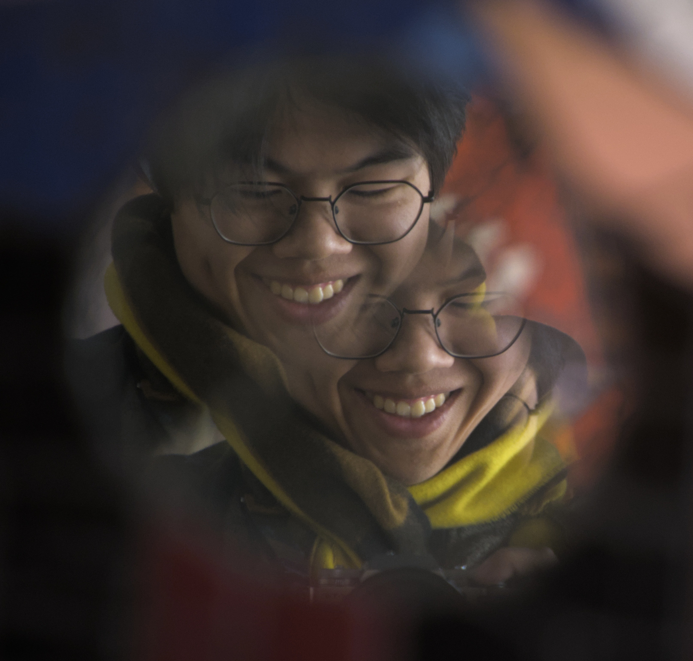

<!-- Everything is wrapped here to animate flawlessly without layout popping -->

    

    

        Jimmy Tsai is a Taiwanese-American based in the Bay Area and Chicago. Photography and filmmaking are his creative release as he studies his engineering degree. He mainly does street photography, but he's down for any project, big or small. Contact him through email or on Instagram.
    

    <a href="https://www.youtube.com/channel/UCQulP0uyasw93322XVnpvZQ" class="color-change-target" target="_blank">
        <i class="bi bi-youtube" style="font-size: 2rem;"></i>
    </a>
    <a href="https://www.instagram.com/jimbot.tsai" class="color-change-target" target="_blank">
        <i class="bi bi-instagram" style="font-size: 2rem;"></i>
    </a>
    <a href="mailto:info.jimbot@gmail.com" class="color-change-target">
        <i class="bi bi-envelope" style="font-size: 2rem;"></i>
    </a>

